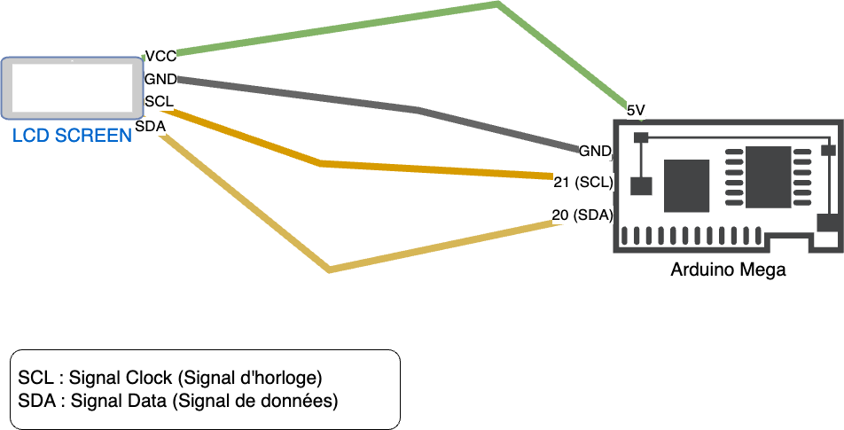
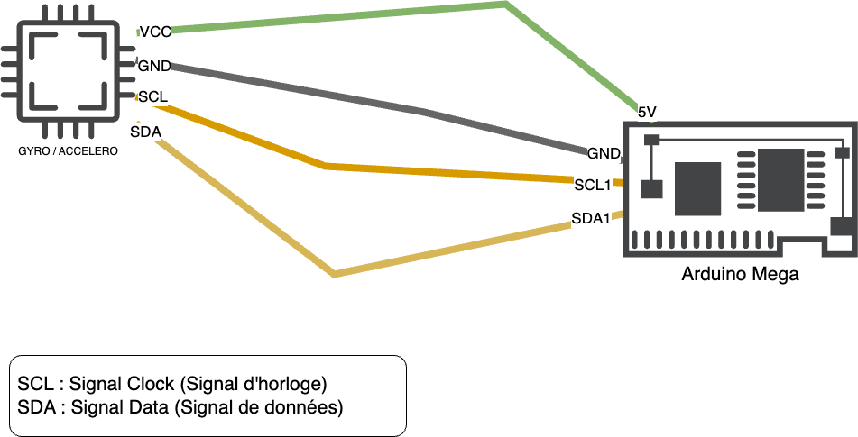
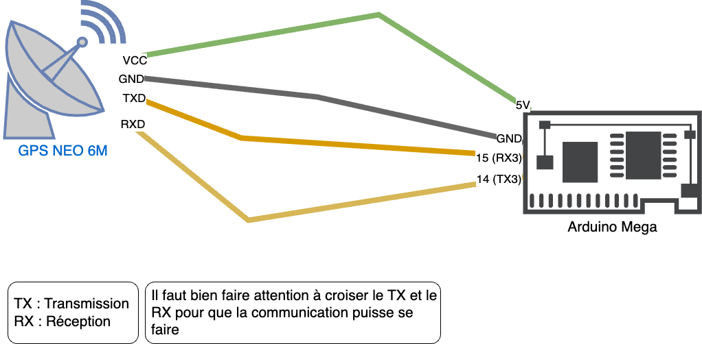

# MotoConnect (Arduino Code)

Le boitier est conçu dans le but de donner les informations en temps réel de la moto grâce à l'arduino et aux différents modules qui le compose. Il y a un module GPS, un module gyroscope et accéléromètre, un écran lcd, et un module pour communiquer 
avec internet (ESP32) et un module sim pour avoir une connexion 4g à portée du boitier. Ce module va envoyer différentes informations importantes pour le bon fonctionnement d'application mobile 
(cf [motoconnect-mobile](https://github.com/MotoConnect/motoconnect-mobile)). Ces informations sont les suivantes :

- Vitesse de la moto
- Inclinaison de la moto
- Température extérieur (Afficher seulement sur l'écran lcd)
- Position GPS de la moto

## Schéma de l'architecture

